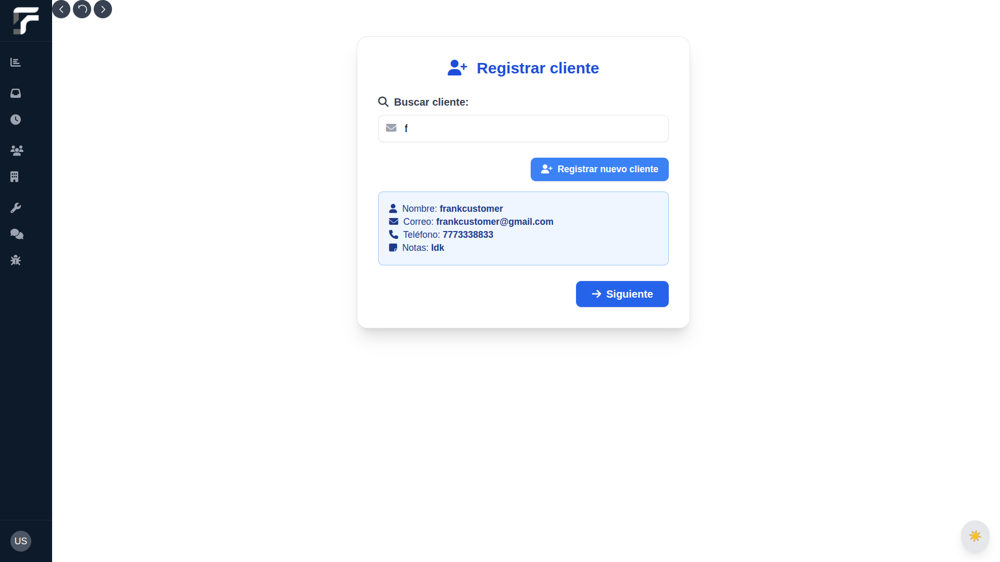
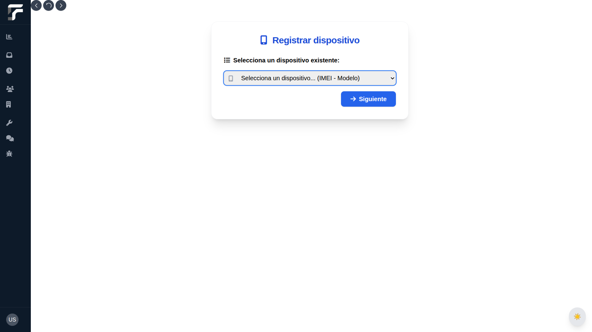
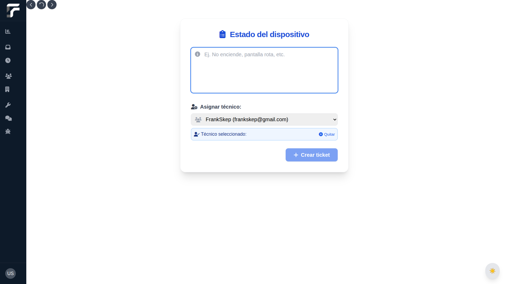
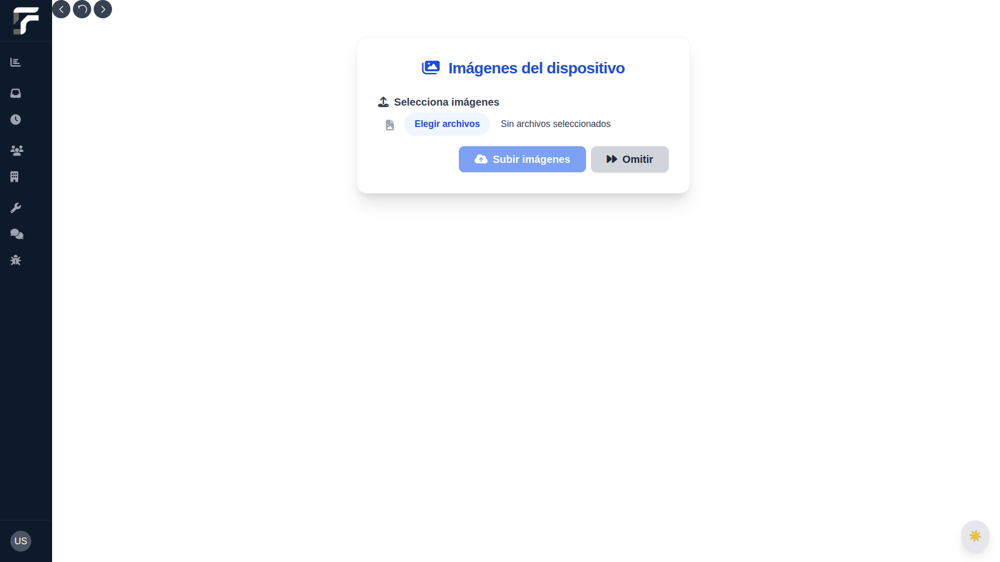
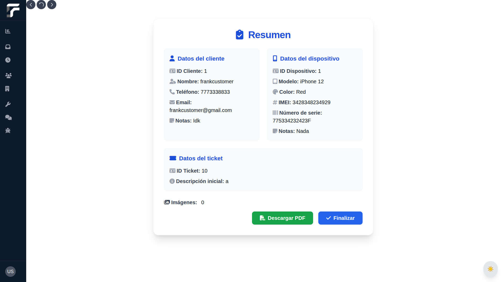

# Fixium – Ecosystem for iOS Repair Workshops

Fixium is a **comprehensive management platform** designed for iOS device repair workshops. It integrates a robust backend, a modern frontend, and smart technical tools to streamline operations, enhance security, and improve technician productivity.

> **Note:**  
> This repository contains **public documentation only**. The project’s source code is private and proprietary.  
> Demo available upon request.

---

## Table of Contents

- [Overview](#overview)
- [Problem it Solves](#problem-it-solves)
- [Features](#features)
- [Architecture](#architecture)
- [Technologies Used](#technologies-used)
- [Impact](#impact)
- [My Role](#my-role)
- [License](#license)
- [Contact](#contact)

---

## Overview

Fixium centralizes the management of workshops, users, customers, devices, and repairs into a single ecosystem composed of:

- **Backend REST API:** Java 21 + Spring Boot  
- **Frontend Web App:** SvelteKit + TailwindCSS + Electron  
- **Password Reset Microfrontend:** SvelteKit  
- **Local Technical Tools Service:** FastAPI

---

## Problem it Solves

Fixium optimizes technical workshop operations by integrating:

- **Facial verification** for enhanced security  
- **AI-powered technical tools** for diagnostics and log analysis  
- **Automated email notifications** for customer and user events

This improves productivity, security, and customer satisfaction in repair processes.

---

## Features

✅ **Robust Backend:**

* **API REST** built with **Java 21 + Spring Boot**
* **Multi-tenant architecture** supporting multiple workshops
* **JWT authentication** with role-based access (`ADMIN`, `TECHNICIAN`, `RECEPTIONIST`)
* **Facial verification** using AWS Rekognition for critical operations
* **User & Workshop Management:**

  * Workshop registration with tenant isolation
  * Full CRUD for users with role assignment
  * Capture and storage of **5 facial photos per user** for future verifications
  * Password update and account deletion endpoints
* **Ticket & Repair Management:**

  * Customer and device registration
  * Ticket creation with image uploads (Cloudinary)
  * Ticket assignment to technicians
  * Technician-only ticket viewing permissions
  * Repair registration protected with facial verification
  * PDF ticket generation (OpenPDF)
  * Query repair history by device
* **AI-powered Tools (Qwen3 API):**

  * **Technical assistant chat** for troubleshooting
  * **Panic log analysis** (text/file) with actionable insights
* **Email Notifications:**

  * To users upon registration and account deletion
  * To customers when tickets are created, updated, or completed
* **Global Security & Validation:**

  * Role-based endpoint protection with `@PreAuthorize`
  * Centralized input validation (Jakarta Validation)
  * Global exception handling

✅ **Modern Frontend:**

* Developed in **SvelteKit + TailwindCSS**
* **Electron integration** for desktop deployment (optional)
* Dashboard with statistics and charts (Chart.js)
* Role-based route protection and authentication
* Technical tools for firmware downloads, backups, logs, recovery mode, etc.
* Real-time facial verification via camera

✅ **Local Diagnostic & Restoration Service:**

* **FastAPI microservice** running locally on technician computers
* Provides **iOS device diagnostics and restoration operations** using the `libimobiledevice` library
* Consumed by the frontend app (web or desktop) for direct device interaction

✅ **Password Reset Service:**

* Minimal microfrontend with secure token-based password reset
* Flow: User requests reset → Backend sends email with token → User opens **Password Reset frontend** to update credentials securely

---

## Architecture

The system is designed following **Clean Architecture** principles, ensuring scalability and maintainability:

- **Backend REST API:** Java 21 + Spring Boot + PostgreSQL  
- **Frontend Web App:** SvelteKit + TailwindCSS + Electron  
- **Password Reset Frontend:** Standalone SvelteKit app  
- **Local Tools Service:** FastAPI for technical utilities

Each module maintains:

- **SOLID principles**  
- Centralized validations and global exception handling  
- Advanced security for critical endpoints (e.g. repairs) with facial verification  
- Multi-tenant design: each workshop operates as a logically independent instance

---

## Technologies Used

- **Backend:** Java 21, Spring Boot, Spring Security (JWT), JPA/Hibernate, PostgreSQL, Cloudinary, AWS Rekognition, Qwen3 API, OpenPDF
- **Frontend:** SvelteKit, TailwindCSS, Electron, Chart.js, GSAP, Marked
- **Local Tools:** FastAPI

---

## Impact

✔️ Streamlines workshop operations  
✔️ Enhances security with facial verification  
✔️ Improves technician efficiency via AI tools  
✔️ Scalable for multiple branches or franchises

---

## Screenshots

<strong>General Screenshots</strong>

  

  

  

  

  

  

  

  

  

<strong>Ticket Registration Flow</strong>

  

  

  

  

  

---

## My Role

- **Backend Developer & System Architect:**  
  - Designed and developed the REST API with Spring Boot  
  - Implemented multi-tenant database architecture  
  - Integrated external services: AWS Rekognition, Cloudinary, Qwen3 API  
  - Designed authentication and security layers

- **Frontend Developer:**  
  - Developed critical flows in SvelteKit  
  - Integrated Electron for desktop support  
  - Implemented route protection, real-time facial verification, and form validations

---

## License

All rights reserved. This repository is for **portfolio and documentation purposes only**.  
No source code is included.

---

## Contact

For inquiries, demo access, or technical discussion, please contact:

**Frank** – Software Engineer  
[Email](mailto:f.cornejo.pacheco@gmail.com)
